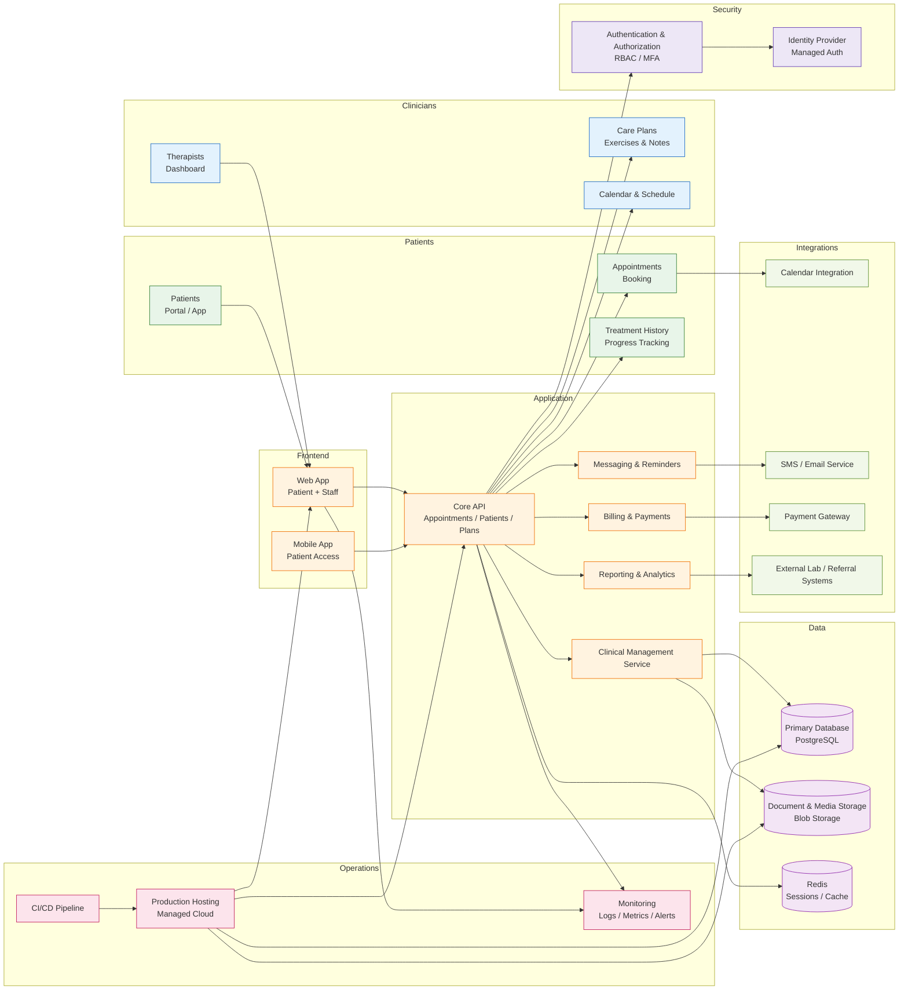

# Healthcare / Physiotherapy Platform Architecture

This architecture is designed for a clinic or physiotherapy practice that needs secure patient data handling, appointment workflows, treatment plans, and business operations in one coherent system.

## Why this architecture fits a physiotherapy platform

This setup is well-suited to healthcare practices because it keeps patient-facing functions separate from clinical workflows, while preserving secure access models for staff and patients.

- Patient portal supports appointments, progress tracking, and communication.
- Therapist dashboard supports treatment planning, notes, schedules, and patient management.
- PostgreSQL provides a reliable store for patient records, schedules, and billing data.
- Object storage safely handles documents, treatment images, and uploaded files.
- Redis improves session speed and common read performance.
- Authentication and role-based access are essential for protecting patient data.
- Messaging and reminders reduce no-shows and improve patient engagement.
- Reporting gives clinics visibility into treatment outcomes, bookings, and revenue.

## Essential security considerations

Because this is healthcare data, security and compliance are critical.

- Use strong authentication with MFA where possible.
- Enforce role-based access controls for clinicians, admin staff, and patients.
- Maintain auditable logs for clinical actions and data changes.
- Secure patient document storage with encryption and access policies.
- Mask or restrict access to sensitive records based on role and consent.
- Validate backups, retention, and recovery processes.

## Recommended stack

- Frontend: Next.js / React
- Backend: Node.js, .NET, or Java
- Database: PostgreSQL
- Cache: Redis
- Storage: AWS S3 or equivalent object storage
- Auth: Auth0, Clerk, Azure AD, Keycloak, or enterprise auth provider
- Messaging: Email/SMS provider
- Payment: Stripe or a local billing provider
- Monitoring: Sentry, Grafana, PostHog, cloud logs, and alerting
- Hosting: Vercel, Azure, AWS, or managed cloud platform

## Best fit

This architecture suits:

- private physiotherapy practices
- rehabilitation clinics
- treatment centres with multiple therapists
- healthcare businesses with online booking and patient communications

## Summary

This is the recommended healthcare architecture for a physiotherapy platform: secure patient access, therapist workflows, appointment and treatment management, billing, reminders, and analytics in a clear, scalable system.
