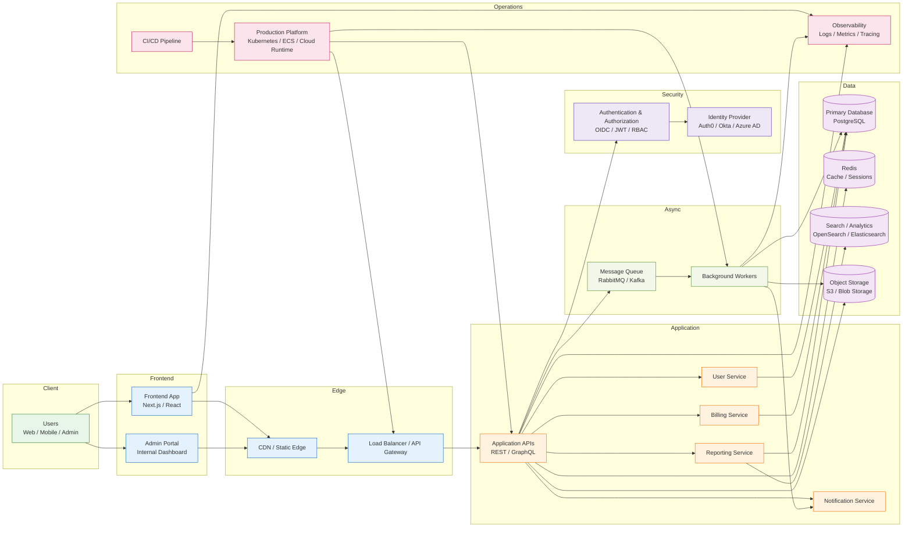

# Recommended SaaS Architecture for a Scalable Product

This architecture is ideal for a mature startup or SaaS product that needs strong scalability, security, and maintainability without overengineering the platform.

## Why this architecture is recommended

This is a strong default for a SaaS business that has outgrown a simple monolith and needs independent scaling, clear domain boundaries, and better operational reliability.

- Frontend and API traffic are separated behind a load balancer and CDN.
- Authentication is centralized so security and access control stay consistent.
- Domain services can evolve independently for user management, billing, reporting, and notifications.
- Redis helps accelerate access to common reads and session data.
- PostgreSQL remains the consistent source of truth for transactional data.
- Search and analytics are separated to support reporting and large datasets efficiently.
- A queue and worker layer decouple background tasks such as email, jobs, and downstream processing.
- Observability tools support fast detection, diagnosis, and response to failures.

## Suggested stack

- Frontend: Next.js or React
- API: Node.js, .NET, Go, Java, or Python
- Database: PostgreSQL
- Cache: Redis
- Search: OpenSearch or Elasticsearch
- Messaging: RabbitMQ or Kafka
- Storage: AWS S3, Azure Blob Storage, or equivalent
- Identity: Auth0, Okta, Azure AD, Clerk, or Keycloak
- Infrastructure: Kubernetes, ECS, or managed cloud runtime
- Monitoring: Prometheus, Grafana, OpenTelemetry, Sentry, and cloud-native logging

## Best fit

This architecture works well for:

- SaaS products with multiple business domains
- Products with user authentication and billing workflows
- Applications requiring robust observability and scale
- Teams that need independent deployment and service ownership

## When to simplify it

If the product is still small or early-stage, use the lean architecture version instead. This SaaS architecture is best once the application starts needing:

- multiple teams
- independent service scaling
- more robust observability
- asynchronous workflows
- heavier reporting or analytics

## Summary

This is the recommended production-grade SaaS architecture: a scalable, secure, domain-based system with clear boundaries, background processing, and strong operational tooling. It is the right choice when the product is growing beyond the MVP stage but still needs maintainability and predictable complexity.
