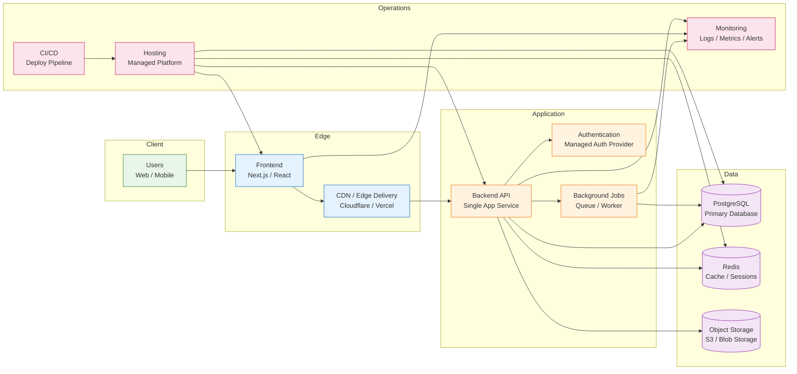

# Recommended Lean Architecture for an MVP or Early-Stage Product

This architecture is the best low-cost option for teams that want a reliable production setup without introducing unnecessary complexity.

## Why this architecture is recommended

This is the most practical choice for an early-stage product because it balances cost, speed, and reliability.

- One API service keeps the system easier to build and operate.
- PostgreSQL provides a solid, flexible relational database.
- Redis improves performance for caching and session handling.
- Object storage handles files, media, and large uploads cheaply.
- Managed auth reduces security work and onboarding time.
- A simple queue supports background processing without extra complexity.
- Managed hosting and CI/CD reduce operational burden.

## Suggested technology stack

- Frontend: Next.js or React
- Backend: Node.js, .NET, Python FastAPI, Laravel, or Java Spring
- Database: PostgreSQL
- Cache: Redis
- Object storage: AWS S3, DigitalOcean Spaces, or equivalent
- Auth: Auth0, Clerk, Supabase Auth, Firebase Auth, or Keycloak
- Hosting: Vercel, Render, Railway, Fly.io, Azure App Service, or AWS ECS
- Monitoring: Sentry, LogRocket, PostHog, Grafana, CloudWatch, or similar
- Background jobs: Redis Queue, RabbitMQ, or a managed cloud queue

## Best fit

This architecture is ideal for:

- MVPs and early-stage SaaS products
- Internal business apps
- Small e-commerce or marketplace products
- Teams wanting to move quickly without excessive infrastructure complexity

## When to evolve it

As the app grows, split the monolith only when the complexity justifies it.
Typical signs include:

- large traffic spikes
- multiple teams working independently
- separate domain logic that needs independent deployment
- billing, notifications, or reporting becoming bottlenecks

At that point, you can break out services like auth, billing, search, and notifications.

## Summary

This is the recommended lean architecture: a single app service, PostgreSQL, Redis, managed auth, object storage, CI/CD, and basic monitoring. It keeps cost low while still being strong enough for production workloads and easy to evolve later.
