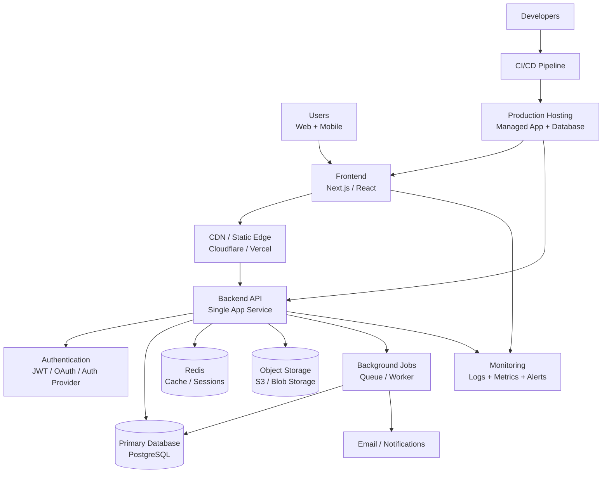

# Simpler and Cheaper Architecture Recommendation

This is the best low-cost, low-complexity architecture for a small or early-stage product that still needs to be reliable and scalable enough for growth.

## Recommended approach

Use a simple monolithic backend instead of a microservices system.

This architecture keeps operational overhead low while still allowing growth later.

## Why this is cheaper

- One application service is easier to deploy and maintain.
- A single PostgreSQL database reduces infrastructure and operational complexity.
- Redis is optional but very useful for caching and session storage.
- Managed services reduce DevOps work.
- Background jobs are optional and only added when necessary.
- A CDN improves performance without expensive custom infrastructure.

## Suggested stack

- Frontend: Next.js or React
- Backend: Node.js, .NET, Laravel, Python FastAPI, or Java Spring
- Database: PostgreSQL
- Cache: Redis
- File/media storage: S3-compatible object storage
- Hosting: Vercel, Render, Railway, Fly.io, Azure App Service, or AWS ECS
- Auth: Supabase Auth, Auth0, Clerk, Firebase Auth, or Keycloak
- Monitoring: Sentry, LogRocket, PostHog, Prometheus + Grafana, or CloudWatch
- Queue: Redis Queue, RabbitMQ, or managed cloud queue

## Good fit for

- Startup MVPs
- Small SaaS products
- Internal tools and dashboards
- Early-stage e-commerce or booking apps
- Teams with limited engineering overhead

## When to evolve

As traffic and complexity grow, you can gradually split the app into:

- user service
- billing service
- notifications service
- reporting service

But only do that when the team clearly needs it. Most products do not need microservices from day one.

## Summary

This is the simplest architecture that still feels production-ready: one app, one database, optional cache, optional queue, managed hosting, and a small monitoring layer. It minimizes cost while keeping room to grow.
