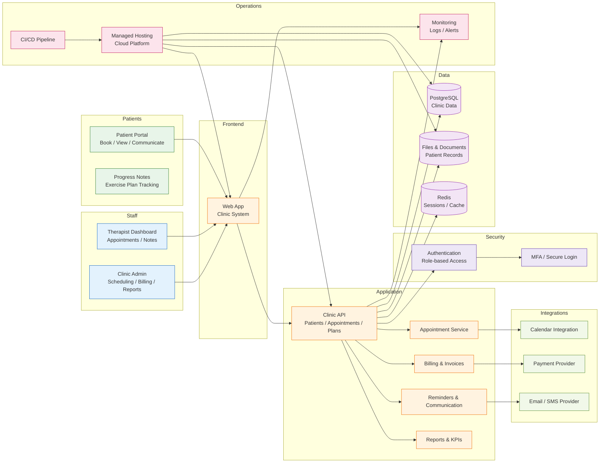

# Single Clinic Physiotherapy Platform Architecture

This is the recommended architecture for a single physiotherapy clinic that needs a basic but solid digital platform for patient management, scheduling, clinician workflows, and billing.

## Why this architecture is the right fit for a single clinic

A single-clinic setup does not need a large distributed system. It needs a stable, secure system that handles scheduling, records, treatment plans, and billing without unnecessary complexity.

- Patient portal supports booking and basic communication.
- Therapist dashboard handles treatment plans, notes, and appointment management.
- Admin workflows support billing, scheduling, and practice reporting.
- PostgreSQL is a strong primary database for a small clinic environment.
- Document storage supports patient records, intake forms, and treatment files.
- Redis speeds up common access patterns like sessions and caching.
- Managed hosting keeps operations simple and cost-effective.

## Recommended stack

- Frontend: Next.js or React
- Backend: Node.js, .NET, or Python
- Database: PostgreSQL
- Cache: Redis
- File storage: AWS S3 or equivalent object storage
- Auth: Auth0, Azure AD, Keycloak, or a secure managed auth provider
- Payments: Stripe or a local billing provider
- SMS / email: Twilio, SendGrid, or clinic-friendly provider
- Hosting: Vercel, Render, Azure, AWS, or a managed cloud platform

## Key clinic requirements

- Secure handling of patient records and treatment notes
- Role-based access for therapists, admin staff, and patients
- Appointment booking and calendar integration
- Reminder workflows for no-shows and follow-ups
- Invoice/billing support
- Reporting for revenue, attendance, and therapist productivity

## Summary

This is the recommended architecture for a single physiotherapy clinic: a streamlined web platform with secure access, patient workflows, clinician management, billing, reminders, and reporting, while keeping cost and complexity manageable.
