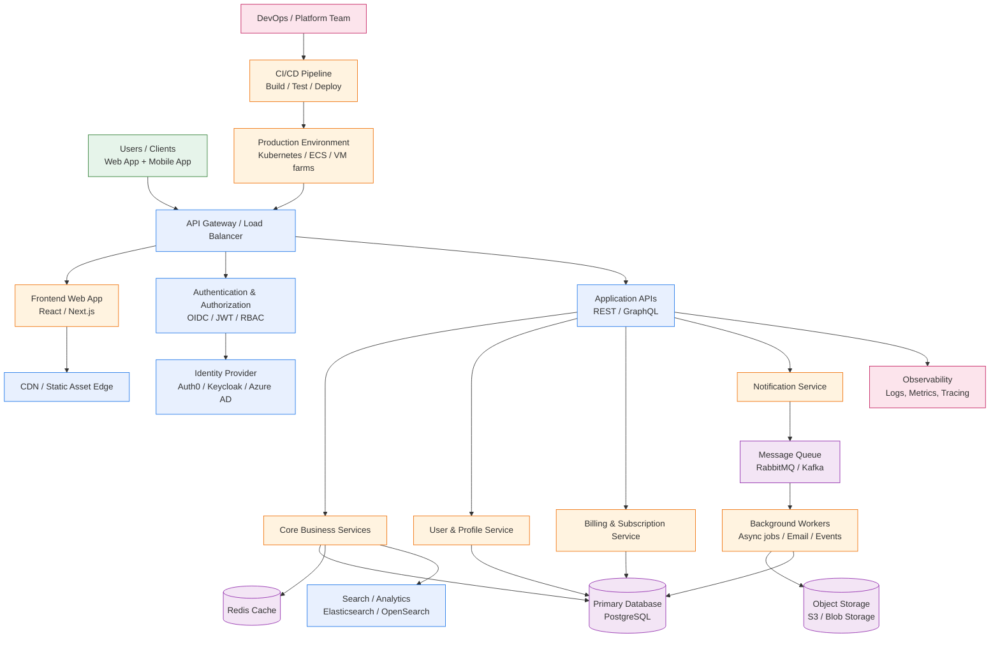

# Recommended Architecture Overview

This is a practical, scalable architecture recommendation for a modern web application or SaaS product. It balances performance, security, maintainability, and observability without being overly complex.

## Why this architecture works

- Frontend and API separation: improves scalability and easier deployment.
- API Gateway / Load Balancer: centralizes routing, TLS termination, and traffic control.
- Authentication service: keeps identity concerns isolated and easier to secure.
- Microservice-oriented backend: each domain can scale independently.
- Database + Redis: combines durable storage with fast caching.
- Message queue: decouples long-running work from synchronous user requests.
- Object storage: handles media, uploaded files, logs, and other large payloads efficiently.
- Observability: gives you logs, metrics, tracing, and alerting for production troubleshooting.
- CI/CD: automates deployment and reduces manual risk.

## Recommended stack

- Frontend: Next.js or React
- API: Node.js, .NET, Go, or Java
- Database: PostgreSQL
- Cache: Redis
- Messaging: RabbitMQ or Kafka
- Storage: S3-compatible object storage
- Container orchestration: Kubernetes or ECS
- Identity: Auth0, Keycloak, Okta, or Azure AD
- Monitoring: Prometheus + Grafana, OpenTelemetry, Loki

## Best-fit use cases

This pattern is a strong default for:

- SaaS products
- Internal business platforms
- E-commerce apps
- APIs with user management and billing
- Systems that need horizontal scale and good reliability

## When to simplify it

If the product is small, start with:

- Single frontend app
- One backend service
- One PostgreSQL database
- Redis cache
- Simple CI/CD

As traffic and complexity grow, introduce the gateway, queue, worker services, and observability layers incrementally.

## Summary

The recommended architecture is a cloud-native, layered system designed for growth, security, and operational reliability. It provides a good balance between simplicity and scalability for most product teams.
